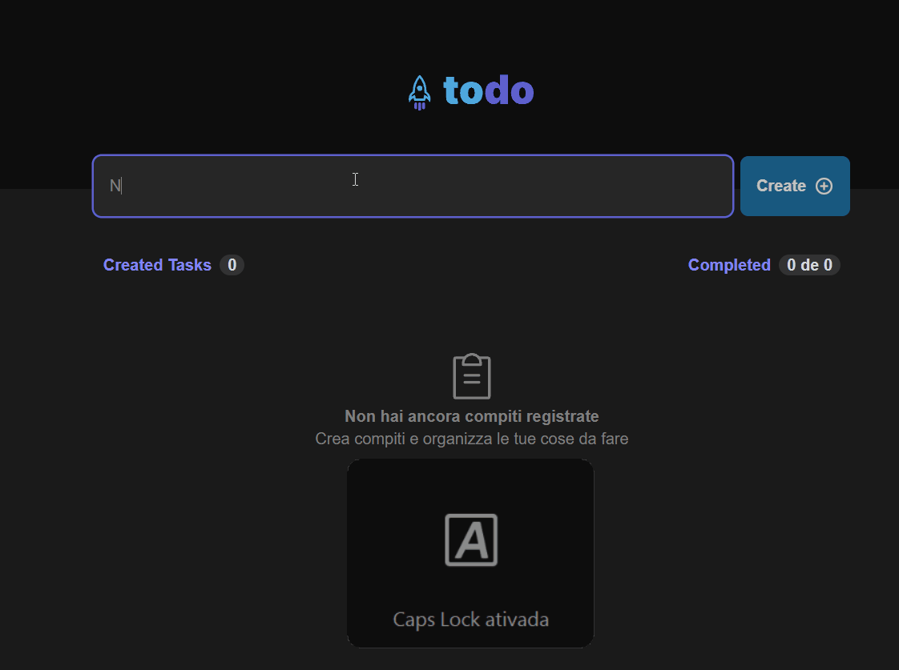

<h1 align="center"> TODO </h1>

<p align="center">
  <a href="#tech">Tech</a>&nbsp;&nbsp;&nbsp;|&nbsp;&nbsp;&nbsp;
  <a href="#project">Projeto</a>&nbsp;&nbsp;&nbsp;|&nbsp;&nbsp;&nbsp;
  <a href="#getting-started">Getting Started</a>
</p>


## Tech

- React
- Typescript
- SCSS

## Project 

Even though it's a simple project it was great to review some key concepts of react as state, immutability, components, props, prop types.



## Getting Started

Clone the project and access the folder.

```
git clone https://github.com/filipesaretta/todo-list-ts

cd todo-list-ts
```

Install the dependencies and start.

``` 
npm install

npm run dev
```

The design is from a challenge by [Rocketseat](https://github.com/rocketseat-content).